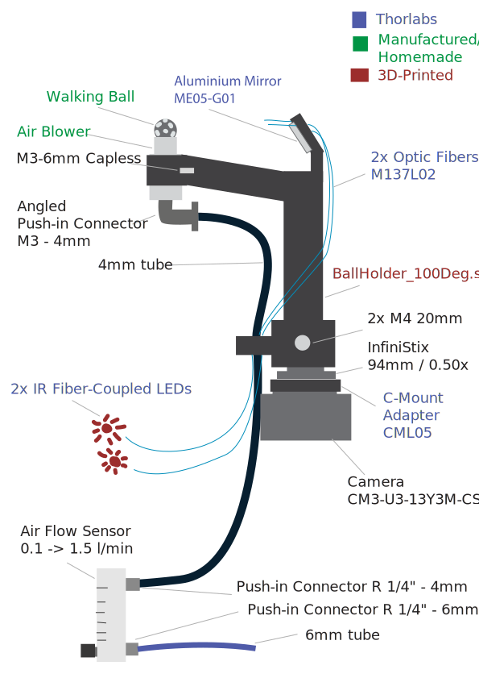

## Required Parts

<b>Thorlabs</b>:
- 1 Aluminium Mirror <a href="https://www.thorlabs.com/item/ME05-G01">ME05-G01</a>
- 1 CS to C Mount Adaptor <a href="https://www.thorlabs.com/item/CML05">CML05</a>
- 2 Fiber Optic Cable <a href="https://www.thorlabs.com/item/M137L02">M137L02</a>
- 2 IR Fiber-coupled LED of the appropriate wavelength. e.g. <a href="https://www.thorlabs.com/fiber-coupled-leds?tabName=Overview">M850F3</a>)

<b>Other suppliers</b>:
- Teledyne's Chameleon3 Camera, model: <a href="https://www.teledynevisionsolutions.com/en-150/products/chameleon3-usb3/?model=CM3-U3-13Y3M-CS&vertical=machine%20vision&segment=iis">CM3-U3-13Y3M-CS</a>
- InfiniStix Lens, model <a href="https://www.edmundoptics.de/p/infinistix-05x-94mm-wd-video-lens/11346/">0.5X 94mm WD</a>
- Angled Push-in Pneumatic M3 - 4mm Connector model: <a href="https://www.landefeld.de/artikel/de/winkel-steckanschluss-m-3-4mm-iqs-mini/IQSML%20M34">IQSML M34</a>
- Push-in Pneumatic R 1/4" - 4mm Connector model: <a href="https://www.landefeld.de/artikel/de/gerader-steckanschluss-r-14-4mm-iqs-standard/IQSG%20144">IQSG 144</a>
- Push-in Pneumatic R 1/4" - 6mm Connector model: <a href="https://www.landefeld.de/artikel/de/gerader-steckanschluss-r-14-6mm-iqs-standard/IQSG%20146">IQSG 146</a>
- AirFlow Meter 0.1 -> 1.5L/min model: <a href="https://de.rs-online.com/web/p/durchflusssensoren/2576415?searchId=ebb5b145-609c-4a1f-b4be-6766787836c0">257-6415</a>
- 6mm Air Tube
- 8mm Air Tube
  
<b>Homemade Parts</b>:
- 3D printed <a href="https://github.com/ActiveSensing/General_Setup_Instructions/blob/main/Ball%20Walking%20Camera%20Instructions/3D%20Printed%20and%20Manufactured%20Parts/Yoni_BallHolder_100Deg.stl">BallHolder_100Deg.stl</a>, preferably using an PLA black filament with a Prusa Core Printer
- 8 or 6mm <a href="https://spherotech.net/de/produkte/uebersicht/kugeln/">polyurethane</a> or foam balls with irregular stains <a href="https://github.com/rjdmoore/fictrac/blob/master/doc/requirements.md#track-ball">following Fictrac's instructions</a> (preferably with white IR-absorbant ink)
- Manufactured <a href="https://github.com/ActiveSensing/General_Setup_Instructions/blob/main/Ball%20Walking%20Camera%20Instructions/3D%20Printed%20and%20Manufactured%20Parts/8mm%20Ball%20Blower.pdf">Aluminium Ball Blower</a>

<b>Screws</b>:
- 1x M6 of 6 mm Capless
- 2x M4 of 20mm
  
## Ball Camera Schematic

## Ball Camera Building Instructions

1. Screw the <b>Infinistix lens</b> to the <b>Camera</b> with the <b>C-Mount Adaptor</b> in-between.
2. Plug the <b>Camera</b> to your computer.
3. Screw the <b>Angled Push-in Connector</b> to the <b>Air Blower</b>.
4. Push the <b>Ball Blower</b> into the 3D-printed <b>Ball Holder</b> and secure it with the <b>capless M3 screw</b>.
    - $\color{red}{\textrm{Make sure that the Angled Push-In Connector opens towards the Ball Holder.}}$
    - $\color{red}{\textrm{Make sure that the top flat surface of Ball Blower aligns with the flat surface the Ball Holder.}}$
5. Use 1 <b>M6 screw (10mm)</b> to screw the <b>Dovetail Rail Carrier RC1</b> onto the <b>CasedRailMicromanipulatorAdaptor.</b>
    - $\color{red}{\textrm{Make sure that the RC1's thumb screw will face the user.}}$
    - $\color{red}{\textrm{Make sure that the camera cable will point in the most convinient direction within the setup.}}$

6. Use 1 <b>M4 screws (8mm)</b> to screw the <b>Dovetail Rail RLA075/M</b> onto the <b>CasedRailMicromanipulatorAdaptor</b>.
    - $\color{red}{\textrm{Make sure that the base of the Rail lies on the base of the CasedRailMicromanipulatorAdaptor, so the Rail Carrier can attach on top.}}$

7. Use 4 <b>M3 screws (10mm)</b> to screw the <b>CasedRailMicromanipulatorAdaptor</b> onto the top platform of the <b>macromaniplator LD40-LM</b>.
    - $\color{red}{\textrm{Orient the CasedRailMicromanipulatorAdaptor to make sure that the rail will point in the opposite direction than the fly.}}$
    - $\color{red}{\textrm{Orient the macromanipulator to make sure that all knobs will be easily accessible by the user.}}$
    - $\color{red}{\textrm{Depending on which platform of the macromanipulator is the top one, the caps of the screws will be either top or down.}}$

8. Use 4 <b>M4 screws (10mm)</b> to screw the <b>Adjustable Flip Platform FP90/M</b> onto the flatter side of the <b>MicromanipulatorPlatformAdaptor</b>.

9. Use 4 <b>M3 screws (10mm)</b> to screw the <b>MicromanipulatorPlatformAdaptor</b> onto the base platform of the <b>macromaniplator LD40-LM</b>.
    - $\color{red}{\textrm{Make sure that the locking screw of the Adjustable Flip Platform will face the user}}$
    - $\color{red}{\textrm{Make sure that that locking screw will be opposite direction of the fly (so the structure can tilt away from the fly)}}$

10. Use 2 <b>M4 screws (10mm)</b> to screw the <b>postFixer</b> onto the <b>Adjustable Flip Platform FP90/M</b>.

11. Use 1 <b>M3 screws (20mm)</b> to fix the <b>Optical Post</b> onto the <b>postFixer</b>.

12. Fix the <b>Post Holder</b> onto the Setup (More stable if using the optional <b>Swivel Base Adapter</b>).
    - $\color{red}{\textrm{The thumb screw of the Post Holder should face the user}}$

13. Fix the <b>Optical Post</b> into the <b>Post Holder</b>.

14. Fix the <b>Dovetail Rail Carrrier RC1</b> onto the <b>Dovetail Rail RLA075/M</b>.

15. Attach the <b>InfiniStix Lens</b> onto the <b>camera</b>

## Ball Camera Mounting Options Schematic

13. Insert the optional <b>Bandpass filter</b> into the <b>InfiniStix Lens</b> and secure it with the InfiniStix_FilterHolder.stl
