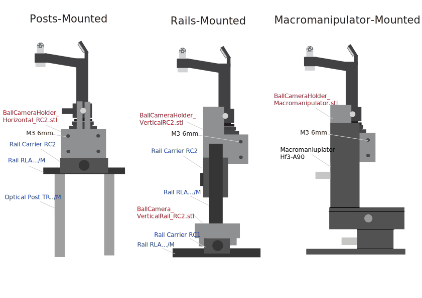

## Ball Camera Schematic

## Required Parts

<b>Thorlabs</b>:
- 1 Aluminium Mirror <a href="https://www.thorlabs.com/item/ME05-G01">ME05-G01</a>
- 1 CS to C Mount Adaptor <a href="https://www.thorlabs.com/item/CML05">CML05</a>
- 2 Fiber Optic Cable <a href="https://www.thorlabs.com/item/M137L02">M137L02</a>
- 2 IR Fiber-coupled LED of the appropriate wavelength. e.g. <a href="https://www.thorlabs.com/fiber-coupled-leds?tabName=Overview">M850F3</a>)

<b>Other suppliers</b>:
- Teledyne's Chameleon3 Camera, model: <a href="https://www.teledynevisionsolutions.com/en-150/products/chameleon3-usb3/?model=CM3-U3-13Y3M-CS&vertical=machine%20vision&segment=iis">CM3-U3-13Y3M-CS</a>
- InfiniStix Lens, model <a href="https://www.edmundoptics.de/p/infinistix-05x-94mm-wd-video-lens/11346/">0.5X 94mm WD</a>
- Angled Push-in Pneumatic M3 - 4mm Connector model: <a href="https://www.landefeld.de/artikel/de/winkel-steckanschluss-m-3-4mm-iqs-mini/IQSML%20M34">IQSML M34</a>
- Push-in Pneumatic R 1/4" - 4mm Connector model: <a href="https://www.landefeld.de/artikel/de/gerader-steckanschluss-r-14-4mm-iqs-standard/IQSG%20144">IQSG 144</a>
- Push-in Pneumatic R 1/4" - 6mm Connector model: <a href="https://www.landefeld.de/artikel/de/gerader-steckanschluss-r-14-6mm-iqs-standard/IQSG%20146">IQSG 146</a>
- AirFlow Meter 0.1 -> 1.5L/min model: <a href="https://de.rs-online.com/web/p/durchflusssensoren/2576415?searchId=ebb5b145-609c-4a1f-b4be-6766787836c0">257-6415</a>
- 6mm Air Tube
- 8mm Air Tube

<b>Homemade Parts</b>:
- 3D printed <a href="https://github.com/ActiveSensing/General_Setup_Instructions/blob/main/Ball%20Walking%20Camera%20Instructions/3D%20Printed%20and%20Manufactured%20Parts/Yoni_BallHolder_100Deg.stl">BallHolder_100Deg.stl</a>, preferably using an PLA black filament with a Prusa Core Printer
- 8 or 6mm <a href="https://spherotech.net/de/produkte/uebersicht/kugeln/">polyurethane</a> or foam balls with irregular stains <a href="https://github.com/rjdmoore/fictrac/blob/master/doc/requirements.md#track-ball">following Fictrac's instructions</a> (preferably with white IR-absorbant ink)
- Manufactured <a href="https://github.com/ActiveSensing/General_Setup_Instructions/blob/main/Ball%20Walking%20Camera%20Instructions/3D%20Printed%20and%20Manufactured%20Parts/8mm%20Ball%20Blower.pdf">Aluminium Ball Blower</a>

<b>Screws</b>:
- 1x M6 of 6 mm Capless
- 2x M4 of 20mm

## Ball Camera Building Instructions

1. Screw the <b>Infinistix lens</b> to the <b>Camera</b> with the <b>C-Mount Adaptor</b> in-between.
2. Screw the <b>Angled Push-in Connector</b> to the <b>Air Blower</b>.
3. Insert the <b>Ball Blower</b> into the 3D-printed <b>Ball Holder</b> and secure it with the <b>capless M3 screw</b>.
    - $\color{red}{\textrm{Make sure that the Angled Push-In Connector opens towards the Ball Holder.}}$
    - $\color{red}{\textrm{Make sure that the top flat surface of the Ball Blower aligns with the flat surface the Ball Holder.}}$
4. Insert the mounted <b>Infinistix lens</b> into the <b>Ball Holder</b>.
5. Plug the <b>Camera</b> to your computer and run the <i>SpinView Software</i>.
6. Insert the <b>Aluminium Mirror</b> into the <b>Ball Holder</b> and place the Ball onto the <b>Ball Blower</b>.
7. Looking at Spinview, make sure that the <b>Ball Blower</b> is in the middle of the camera frame and the whole <b>Ball</b> is visible.
    - $\color{red}{\textrm{If the Ball or the Ball Blower are not centered or do not fit with the Camera's frame, remove the Ball and the Mirror.}}$
      $\color{red}{\textrm{Then, fix the Ball Holder's mirror's slot with sandpaper (!!!just a tiny bit!!) or the placement of tiny piece of tissues and try again..}}$
8. Keep the <b>Ball</b> and the <b>Ball Holder</b> in a away (and safe) for now.
9. Screw the <b>M4 screws (20mm)</b> on both to side of the <b>Ball Holder</b>.

### --> At this point, choose your Camera Mounting option (Below) and build it within your experimental setup.</u>
 

10. Screw your <b>Camera</b> to your now built mounting option.
11. Insert the camera's <b>Lens</b> into <b>Ball Holder</b> into it's final position.
12. Pass the <b>4mm tube</b> inside the <b>Ball Holder</b>'s cable hole and connect it to the <b>Angled Push-in Connector</b>.
13. Screw the <b>Push-in Connector 4mm</b> to the output thread (the top one) of the <b>Air Flow Sensor</b>, and the <b>Push-in Connector 6mm</b> to the input thread (the bottom one).
14. Fix the <b>Air Flow Sensor</b> where you want it to be around your experimental setup, and connect both the <b>4mm and 6mm tubes</b> to it.
15. Pass the two <b>Optic Fibers</b> inside the <b>Ball Holder</b>'s cable hole and then, through the designated holes on each side of the <b>Mirror</b>.
16. Secure the two <b>Optic Fibers</b> flat on the <b>Ball Holder</b>'s tube using black duc tape.
17. Connect the two <b>Optic Fibers</b> to your IR LEDs

## Ball Camera Mounting Options Schematic

### Required Parts

<b>Posts-Mounted Option</b>:
- Screws:
    - 8x M6 of 8 mm
    - 4x M4 of 10mm
- Thorlabs:
    - 1x Rail Carrier <a href="https://www.thorlabs.com/item/RC2">RC2</a>
    - 1x Dovetail Rail <a href="https://www.thorlabs.com/dovetail-optical-rails?aID=4b89da8e524e262464d6f0284bb86f28&aC=2&tabName=Overview">RLA../M</a> of the required length
    - 2x Optical Posts <a href="https://www.thorlabs.com/optical-posts-half-inch-and-12-mm?tabName=Overview">TR../M</a> of the required length
- 3D-Printed:
    - 1x <a href="https://github.com/ActiveSensing/General_Setup_Instructions/blob/main/Ball%20Walking%20Camera%20Instructions/3D%20Printed%20and%20Manufactured%20Parts/Yoni_BallHolder_100Deg.stl">BallHolder_100Deg.stl</a>

<b>Rails-Mounted Option</b>:
- Screws:
    - 8x M6 of 8 mm
    - 4x M4 of 10mm
- Thorlabs:
    - 1x Rail Carrier <a href="https://www.thorlabs.com/item/RC2">RC2</a>
    - 1x Rail Carrier <a href="https://www.thorlabs.com/item/RC1">RC1</a>
    - 2x Dovetail Rail <a href="https://www.thorlabs.com/dovetail-optical-rails?aID=4b89da8e524e262464d6f0284bb86f28&aC=2&tabName=Overview">RLA../M</a> of the required length
- 3D-Printed:
    - 1x <a href="https://github.com/ActiveSensing/General_Setup_Instructions/blob/main/Ball%20Walking%20Camera%20Instructions/3D%20Printed%20and%20Manufactured%20Parts/BallCameraHolder_VerticalRC2_Sided.stl">BallCameraHolder_VerticalRC2_Sided.stl</a>
    - 1x <a href="https://github.com/ActiveSensing/General_Setup_Instructions/blob/main/Ball%20Walking%20Camera%20Instructions/3D%20Printed%20and%20Manufactured%20Parts/BallCamera_VerticalRail_RC2.stl">BallCamera_VerticalRail_RC2.stl</a>
 
<b>Macromanipulator-Mounted Option</b>:
- Screws:
    - 8x M6 of 8 mm
    - 2x M4 of 10mm
- Other Suppliers:
    - 2x Micromanipulator <a href="https://www.amazon.de/s?k=hF3-A90">hF3-A90</a>, because it's cheap
- 3D-Printed:
    - 1x <a href="https://github.com/ActiveSensing/General_Setup_Instructions/blob/main/Ball%20Walking%20Camera%20Instructions/3D%20Printed%20and%20Manufactured%20Parts/Camera_Micromanipulator_Adaptor_Sided.stl">Camera_Micromanipulator_Adaptor_Sided.stl</a>
