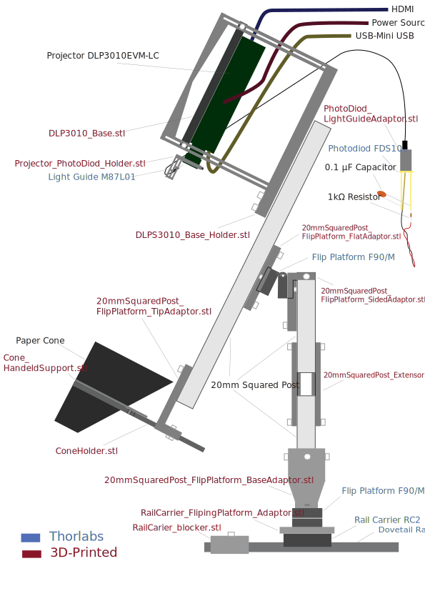

## Ball Camera Schematic

## Required Parts

<b>Thorlabs</b>:
- 1x Dovetail Rail <a href="https://www.thorlabs.com/dovetail-optical-rails?aID=4b89da8e524e262464d6f0284bb86f28&aC=2&tabName=Overview">RLA../M</a> of the required length (I suggest 30cm)
- 1x Rail Carrier <a href="https://www.thorlabs.com/item/RC2">RC2</a>
- 2x Adjustable Flip Platform <a href="https://www.thorlabs.com/item/FP90_M">FP90/M</a>
- 14x M6 Drop-In T-Nut <a href="https://www.thorlabs.com/item/https://www.thorlabs.com/item/XE25T1_M">XE25T1/M</a>
- 1x Photodiod <a href="https://www.thorlabs.com/item/FDS100">FDS100</a>
- 1x Light guide <a href="https://www.thorlabs.com/fiber-coupled-leds?tabName=Overview">M87L01</a>

<b>Other suppliers</b>:
- 1x Texas Instruments's Projector, model: <a href="https://www.ti.com/tool/DLP3010EVM-LC">DLP3010EVM-LC</a>
- 1x TRU Components' 20mm Squared Post, model <a href="https://www.conrad.com/en/p/tru-components-2020a-tc-10493168-brace-aluminium-anodised-1000-mm-x-20-mm-x-20-mm-1-pc-s-2623292.html">TC-10493168</a>
- 1x Capacitor 0.1 μF
- 1x Resistor 1kΩ Push-in Pneumatic R 1/4" - 4mm Connector model: <a href="https://www.landefeld.de/artikel/de/gerader-steckanschluss-r-14-4mm-iqs-standard/IQSG%20144">IQSG 144</a>

<b>3D printed Parts</b> (preferably using an PLA black filament with a Prusa Core Printer):
- <a href="https://github.com/ActiveSensing/General_Setup_Instructions/blob/main/Half-Cone%20Projector%20Instructions/3D%20Printed%20and%20Manufactured%20Parts/Rail%20Carrier%20Accessories/RailCarier_blocker.stl">RailCarier_blocker.stl</a>
- <a href="https://github.com/ActiveSensing/General_Setup_Instructions/blob/main/Half-Cone%20Projector%20Instructions/3D%20Printed%20and%20Manufactured%20Parts/Rail%20Carrier%20Accessories/RailCarrier_FlipingPlatform_Adaptor.stl">RailCarrier_FlipingPlatform_Adaptor.stl</a>
- 2x <a href="https://github.com/ActiveSensing/General_Setup_Instructions/blob/main/Half-Cone%20Projector%20Instructions/3D%20Printed%20and%20Manufactured%20Parts/TC%2020mm%20SquaredPost%20Accessories/20mmSquaredPost_Extensor.stl">20mmSquaredPost_Extensor.stl</a>
- <a href="https://github.com/ActiveSensing/General_Setup_Instructions/blob/main/Half-Cone%20Projector%20Instructions/3D%20Printed%20and%20Manufactured%20Parts/TC%2020mm%20SquaredPost%20Accessories/20mmSquaredPost_FlipPlatform_BaseAdaptor.stl">20mmSquaredPost_FlipPlatform_BaseAdaptor.stl</a>
- <a href="https://github.com/ActiveSensing/General_Setup_Instructions/blob/main/Half-Cone%20Projector%20Instructions/3D%20Printed%20and%20Manufactured%20Parts/TC%2020mm%20SquaredPost%20Accessories/20mmSquaredPost_FlipPlatform_SidedAdaptor.stl">20mmSquaredPost_FlipPlatform_SidedAdaptor.stl</a>
- <a href="https://github.com/ActiveSensing/General_Setup_Instructions/blob/main/Half-Cone%20Projector%20Instructions/3D%20Printed%20and%20Manufactured%20Parts/TC%2020mm%20SquaredPost%20Accessories/20mmSquaredPost_FlipPlatform_FlatAdaptor.stl">20mmSquaredPost_FlipPlatform_FlatAdaptor.stl</a>
- <a href="https://github.com/ActiveSensing/General_Setup_Instructions/blob/main/Half-Cone%20Projector%20Instructions/3D%20Printed%20and%20Manufactured%20Parts/TC%2020mm%20SquaredPost%20Accessories/20mmSquaredPost_FlipPlatform_TipAdaptor.stl">20mmSquaredPost_FlipPlatform_TipAdaptor.stl</a>
- <a href="https://github.com/ActiveSensing/General_Setup_Instructions/blob/main/Half-Cone%20Projector%20Instructions/3D%20Printed%20and%20Manufactured%20Parts/Projector%20Accessories/DLP3010_Base.stl">DLP3010_Base.stl</a>
- <a href="https://github.com/ActiveSensing/General_Setup_Instructions/blob/main/Half-Cone%20Projector%20Instructions/3D%20Printed%20and%20Manufactured%20Parts/Projector%20Accessories/DLPS3010_Base_Holder.stl">DLPS3010_Base_Holder.stl</a>
- <a href="https://github.com/ActiveSensing/General_Setup_Instructions/blob/main/Half-Cone%20Projector%20Instructions/3D%20Printed%20and%20Manufactured%20Parts/Cone%20Supports/ConeHolder.stl">ConeHolder.stl</a>
- <a href="https://github.com/ActiveSensing/General_Setup_Instructions/blob/main/Half-Cone%20Projector%20Instructions/3D%20Printed%20and%20Manufactured%20Parts/Projector%20Accessories/Projector_PhotoDiod_Holder.stl">Projector_PhotoDiod_Holder.stl</a>
- <a href="https://github.com/ActiveSensing/General_Setup_Instructions/blob/main/Half-Cone%20Projector%20Instructions/3D%20Printed%20and%20Manufactured%20Parts/Photodiod%20Accessories/PhotoDiod_LightGuideAdaptor.stl">PhotoDiod_LightGuideAdaptor.stl</a>

<b>Screws</b>:
- M6
- M6 Nuts
- M6 Washers
- M4
- M4 Nuts
- M3
- M3 Nuts

<b>For the Cone</b>:
- 1x A4 sheet of paper (black or white, depending on requirements)
- 1x Super glue (Preferably gel-like to not soak in the paper).
- 1x Waterproof clear spray (The Deichmann's <a href="https://www.deichmann.com/en-gb/p/deichmann-shoe-care-care-spray-shoe-care-transparent-52373/275152">Shoe Care Spary</a> is actually miraculous)
- <a href="https://github.com/ActiveSensing/General_Setup_Instructions/blob/main/Half-Cone%20Projector%20Instructions/3D%20Printed%20and%20Manufactured%20Parts/Cone%20Supports/Cone_HandeldSupport.stl">Cone_HandeldSupport.stl</a>

## Mounting Instructions

### Mounting the Squared Post Structure
1. Saw the <b>Squared Post</b> into 2 pieces of ±16cm and 1 piece of ±30cm. 
2. Align a <b>Flip Platform</b> to the <b>20mmSquaredPost_FlipPlatform_BaseAdaptor.stl</b> and screw it with M4 screws.
3. One by one, slighly hold 4 <b>T-Nuts</b> inside the <b>20mmSquaredPost_FlipPlatform_BaseAdaptor.stl</b> using M6 screws.
4. Slide one 16cm-long <b>Squared Post</b> bit into the <b>20mmSquaredPost_FlipPlatform_BaseAdaptor.stl</b> and secure it by fastening the 4 <b>T-Nuts</b>.
5. Fit a M6 nut inside the <b>RailCarrier_FlipingPlatform_Adaptor.stl</b>.
6. Align the <b>20mmSquaredPost_FlipPlatform_BaseAdaptor.stl</b> to the <b>RailCarrier_FlipingPlatform_Adaptor.stl</b> on the same side as the M6 nut, then secure with M4 screws.
    - $\color{red}{\textrm{Make sure that the platform flipping is parrallele to the length of the RailCarrierFlipingPlatformAdaptor.}}$
7. Align the <b>Rail Carrier RC2</b> to the <b>RailCarrier_FlipingPlatform_Adaptor.stl</b> and secure it with an M6 screw.
    - $\color{red}{\textrm{If the projector is installed between the experimentor and the fly, the right-hand side is on the same side as the base platform's flipping.}}$
      $\color{red}{\textrm{-> For right-handed conviniency, make sure that the Rail Carrier's thumb screw ends up on the right-hand side.}}$
8. Prepare the two <b>20mmSquaredPost_Extensor.stl</b> by slightly screwing <b>T-Nuts</b> onto them.
9. Attach the two 16cm-long <b>Squared Posts</b> together by sliding a <b>20mmSquaredPost_Extensor.stl</b> on both sides perpendicular to the platform's flipping. Thighten the estensors' <b>T-Nuts</b>.
10. Slightly screw 3 <b>T-Nuts</b> to the <b>20mmSquaredPost_FlipPlatform_SidedAdaptor.stl</b> and slide it into the top 16cm-long <b>Squared Posts</b>. Thighten the 3 <b>T-Nuts</b>.
        - $\color{red}{\textrm{Make sure the SquaredPostFlipPlatformSidedAdaptor will face the fly.}}$
11. Screw a <b>Flip Platform</b> to the <b>20mmSquaredPost_FlipPlatform_SidedAdaptor.stl</b> using M4 screws
    - $\color{red}{\textrm{Make sure the flipping side lies on top.}}$
    - $\color{red}{\textrm{If the projector is installed between the experimentor and the fly, the right-hand side is on the same side as the base platform's flipping.}}$
      $\color{red}{\textrm{-> For right-handed conviniency, make sure that the Flip Platform's tightening screw ends up on the right-hand side.}}$
12. Screw the <b>20mmSquaredPost_FlipPlatform_FlatAdaptor.stl</b> to the <b>Flip Platform</b> using M4 screws and slightly screw 2 <b>T-Nuts</b> to it using M6 screws.
13. Slide the 30cm-long <b>Squared Posts</b> onto the <b>20mmSquaredPost_FlipPlatform_FlatAdaptor.stl</b> and thighten the <b>T-Nuts</b>.
14. Screw the <b>Dovetail Rail</b> onto your experimental setup and make sure it is aligned with your fly's holder.
15. Mount the <b>Rail Carrier RC2</b> of your structure onto the <b>Dovetail Rail</b> in your experimental setup and secure it with by thightening it's thumb screw.
    - $\color{red}{\textrm{To help with the incoming projector-cone alignment, make sure the 30cm-long Squared Post faces the experimentator for now.}}$

### Mounting the projector
1. Unscrew the <b>Projector</b> from its metallic platform and screw it back to the <b>DLP3010_Base.stl</b>.
    - $\color{red}{\textrm{To access one of the screw, you will have to first unscrew the top PCB.}}$
2. Gently lie down the <b>DLP3010_Base.stl</b> into the <b>DLPS3010_Base_Holder.stl</b> with the projector facing down.
    - $\color{red}{\textrm{Make sure the Projector's lense points towards the two DLPS3010-Base-Holder's bottom grooves.}}$
3. Fit an M4 nut into each corner of the <b>DLP3010_Base.stl</b> and thighen them with M4 screws passing through the <b>DLPS3010_Base_Holder.stl</b>'s vertical slits.
4. Beneath the <b>DLPS3010_Base_Holder.stl</b>, slightly screw a <b>T-Nuts</b> with M6 screws and washers (beneath the screws) through both grooves
5. Slide the <b>DLPS3010_Base_Holder.stl</b> (projector pointing downard) onto the top of the 30cm-long <b>Squared Post</b> already install in your experiemental setup, then thighten the <b>T-Nuts</b>.
    - $\color{red}{\textrm{The projector's optic should't be aligned yet.}}$

### Mounting the Cone Holder
1. Fit the <b>ConeHolder.stl</b> inside the <b>20mmSquaredPost_FlipPlatform_TipAdaptor.stl</b>'s channel (Curved edge facing )
2. Slightly screw a <b>T-Nuts</b> to the <b>20mmSquaredPost_FlipPlatform_TipAdaptor.stl</b>.
3. Slide the <b>20mmSquaredPost_FlipPlatform_TipAdaptor.stl</b> onto the bottom tip of the Gently lie down the <b>DLP3010_Base.stl</b> into the <b>DLPS3010_Base_Holder.stl</b> with the projector facing down.
    - $\color{red}{\textrm{Make sure the Projector's lense points towards the two DLPS3010-Base-Holder's bottom grooves.}}$
4. Fit an M4 nut into each corner of the <b>DLP3010_Base.stl</b> and thighen them with M4 screws passing through the <b>DLPS3010_Base_Holder.stl</b>'s vertical slits.
5. Beneath the <b>DLPS3010_Base_Holder.stl</b>, slightly screw a <b>T-Nuts</b> with M6 screws and washers (beneath the screws) through both grooves
6. Slide the <b>DLPS3010_Base_Holder.stl</b> onto the top of the 30cm-long <b>Squared Post</b> already install in your experiemental setup, then thighten the <b>T-Nuts</b>. The projector's optic should't be aligned yet.
